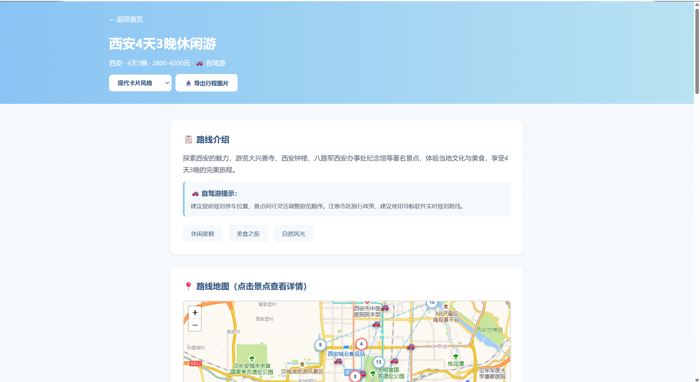
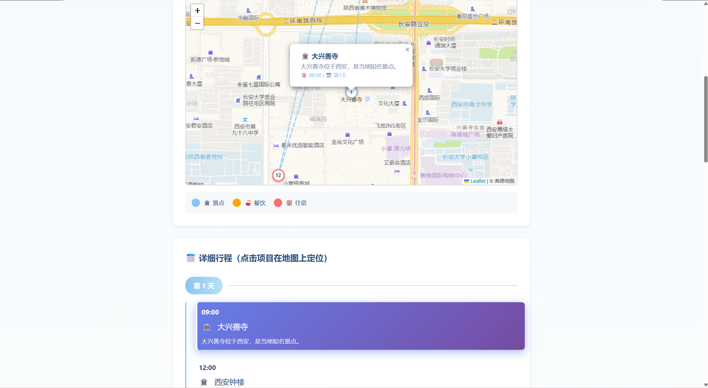
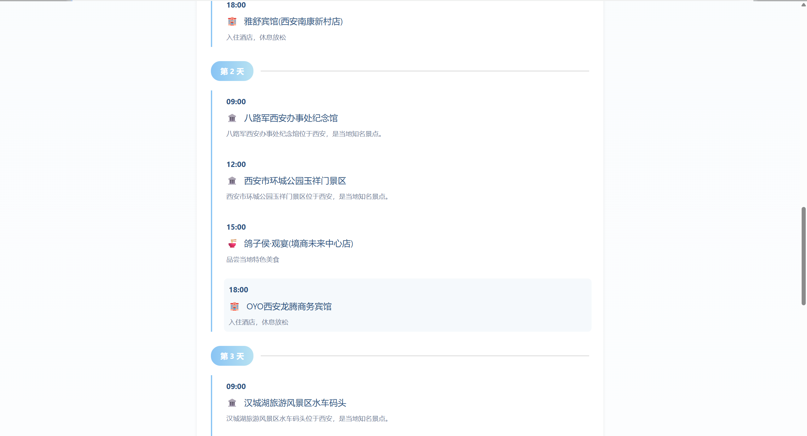
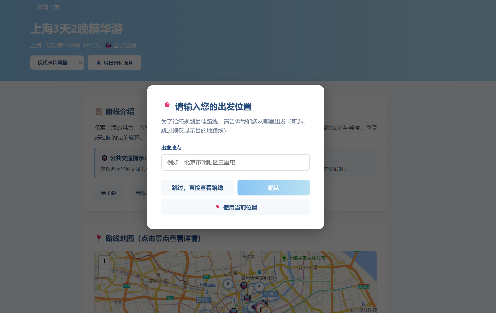
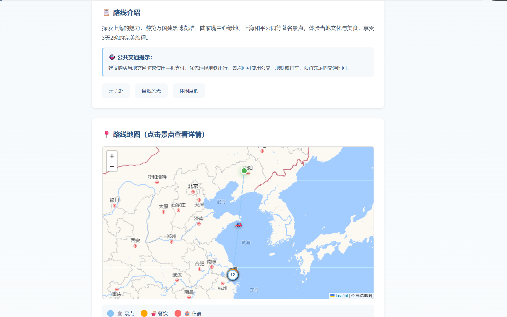

#  智游推荐 — 旅游路线智能推荐平台

基于 Flask + SQLite + Leaflet 的旅游路线智能推荐 MVP 平台，覆盖 15 个热门旅游城市，提供路线浏览、智能推荐、定制行程、地图可视化及行程导出功能。

## 功能特性

| 功能模块 | 说明 |
|---------|------|
|  热门路线 | 按热度排序展示精选旅游路线 |
|  智能推荐 | 根据城市、天数、出行方式推荐合适路线 |
|  地图可视化 | 基于 Leaflet + 高德地图，展示景点标注、路线轨迹、交通方式 |
|  定制行程 | 选择省份/城市/天数/出行方式，生成专属旅行方案 |
|  行程导出 | 支持现代卡片、地铁线路图、信息图三种风格导出行程图片 |
|  数据统计 | API 端点提供路线、景点、酒店、餐厅等数据统计 |

##  覆盖城市

北京 · 上海 · 杭州 · 成都 · 西安 · 厦门 · 丽江 · 三亚 · 桂林 · 青岛 · 苏州 · 南京 · 重庆 · 广州 · 深圳

> 15 个城市，750 景点 / 750 酒店 / 750 餐厅 / 60 条精选路线

##  技术栈

- **后端**: Flask 2.3 + SQLAlchemy 2.0
- **数据库**: SQLite
- **前端**: HTML5 + CSS3 + JavaScript (原生)
- **地图**: Leaflet.js + 高德地图 Web 服务 API
- **数据采集**: 高德 POI API（景点/酒店/餐厅）
- **图片生成**: Pillow（行程导出）
- **环境管理**: python-dotenv

##  项目结构

```
travel_recommending/
├── app.py                  # Flask 主应用，路由与 API 定义
├── config.py               # 全局配置（数据库、API Key、城市列表）
├── export_itinerary.py     # 行程图片导出
├── export_styles.py        # 导出样式定义
├── requirements.txt        # Python 依赖
├── data/
│   ├── travel.db           # SQLite 数据库
│   └── cities.json         # 城市/省份层级数据
├── models/
│   ├── database.py         # SQLAlchemy 引擎与会话
│   ├── attraction.py       # 景点模型
│   ├── hotel.py            # 酒店模型
│   ├── restaurant.py       # 餐厅模型
│   └── route.py            # 路线模型
├── services/
│   ├── amap_service.py     # 高德地图 API 封装
│   └── data_generator.py   # 数据生成器
├── scripts/
│   ├── scrape_amap_poi.py      # 高德 POI 数据爬取
│   ├── init_database.py        # 数据库初始化
│   ├── regenerate_routes.py    # 路线数据重新生成
│   └── ...                     # 其他工具脚本
├── static/
│   ├── css/style.css       # 全局样式
│   ├── js/main.js          # 前端交互逻辑
│   └── images/             # 图片资源
└── templates/
    ├── index.html          # 首页
    ├── route_detail.html   # 路线详情页（含地图）
    ├── 404.html            # 404 页面
    └── 500.html            # 500 页面
```

##  快速开始

### 1. 克隆项目

```bash
git clone https://github.com/<your-username>/travel_recommending.git
cd travel_recommending
```

### 2. 安装依赖

```bash
pip install -r requirements.txt
```

### 3. 配置环境变量

在项目根目录创建 `.env` 文件：

```env
# 高德地图 API Key（用于地图显示和 POI 数据采集）
AMAP_API_KEY=your_amap_api_key_here

# Flask 配置（可选）
SECRET_KEY=your-secret-key
FLASK_ENV=development
```

> 💡 高德 API Key 可在 [高德开放平台](https://lbs.amap.com/) 免费申请。不配置 Key 时地图功能不可用，但路线浏览和推荐功能正常运行。

### 4. 初始化数据库

```bash
python scripts/init_database.py
```

### 5. 启动应用

```bash
python app.py
```

访问 [http://localhost:5000](http://localhost:5000) 即可使用。

##  API 文档

### 页面路由

| 方法 | 路径 | 说明 |
|------|------|------|
| GET | `/` | 首页 |
| GET | `/route/<route_id>` | 路线详情页 |

### 数据接口

| 方法 | 路径 | 说明 |
|------|------|------|
| GET | `/api/home` | 获取热门路线（按热度排序，最多 9 条） |
| GET | `/api/cities` | 获取省份/城市列表 |
| GET | `/api/cities?province=浙江` | 获取指定省份的城市 |
| POST | `/api/recommend` | 智能推荐路线 |
| GET | `/api/route/<route_id>` | 获取路线详情 JSON |
| GET | `/api/export/<route_id>?style=modern_card` | 导出行程图片 |
| GET | `/api/stats` | 数据统计 |
| POST | `/api/admin/clear-cache` | 清除服务端缓存 |


## 🔧 数据采集

项目提供高德 POI 数据爬取脚本，支持按城市和类型批量采集：

```bash
# 爬取所有城市的全部类型数据（每类 50 条）
python scripts/scrape_amap_poi.py --max 50 --clear

# 爬取指定城市
python scripts/scrape_amap_poi.py --city 杭州 --max 50

# 爬取指定类型（attraction / hotel / restaurant）
python scripts/scrape_amap_poi.py --type attraction --max 50

# 清除旧数据后重新爬取
python scripts/scrape_amap_poi.py --city 杭州 --clear
```

>  需要在 `.env` 中配置有效的 `AMAP_API_KEY`。

##  数据规模

| 数据类型 | 数量 |
|---------|------|
| 旅游城市 | 15 |
| 景点（Attraction） | 750 |
| 酒店（Hotel） | 750 |
| 餐厅（Restaurant） | 750 |
| 精选路线（Route） | 60 |
| POI 坐标覆盖率 | 100% |
| 路线-POI 匹配率 | 100% |

> 每个城市包含 50 个景点、50 家酒店、50 家餐厅和 4 条精选路线，数据来源于高德地图 POI API。

##  截图预览

## 首页界面


## 热门路线详情界面




## 定制路线功能界面



