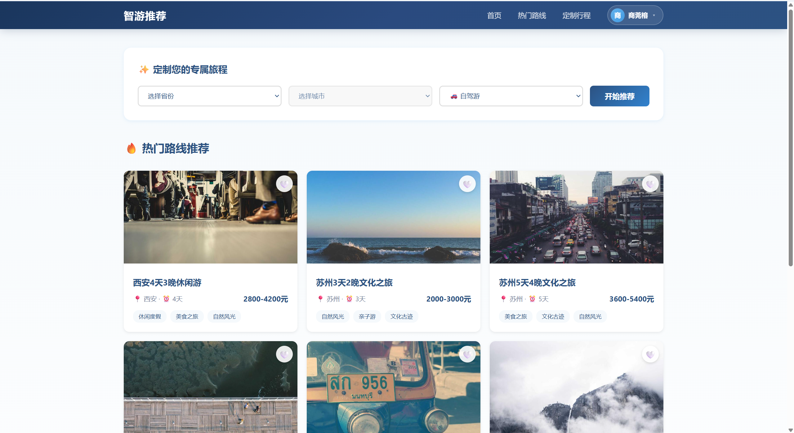
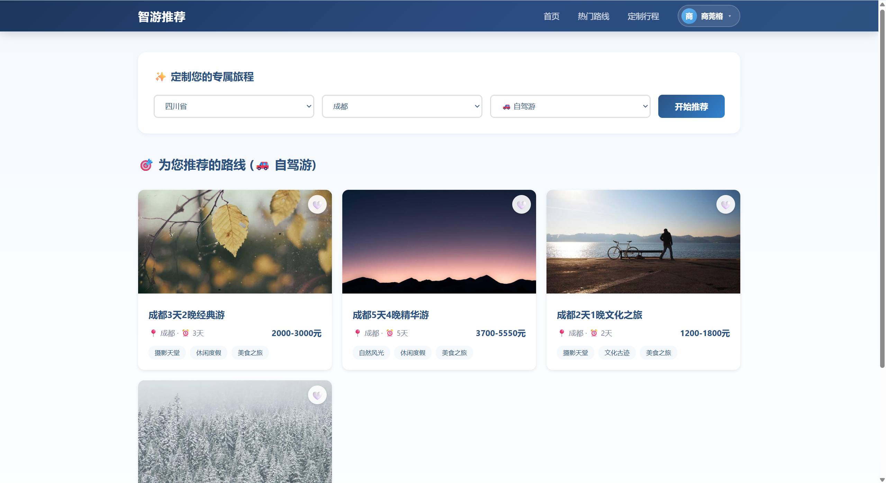
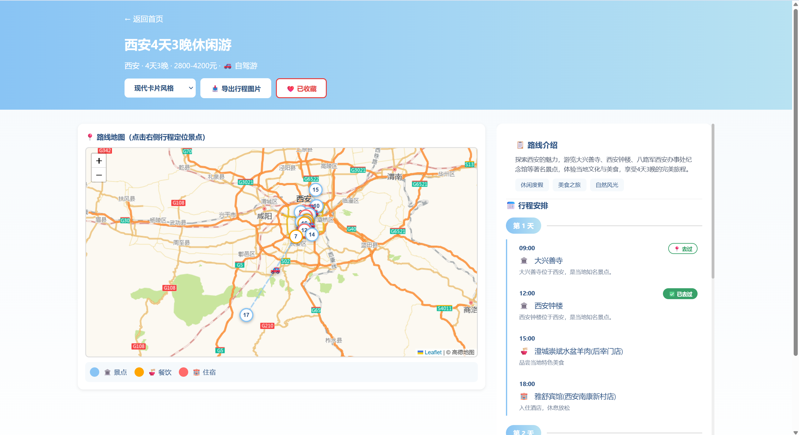
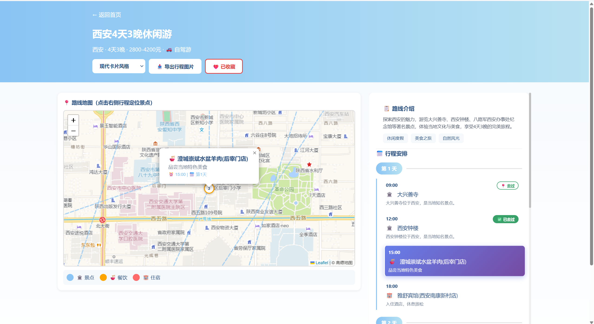
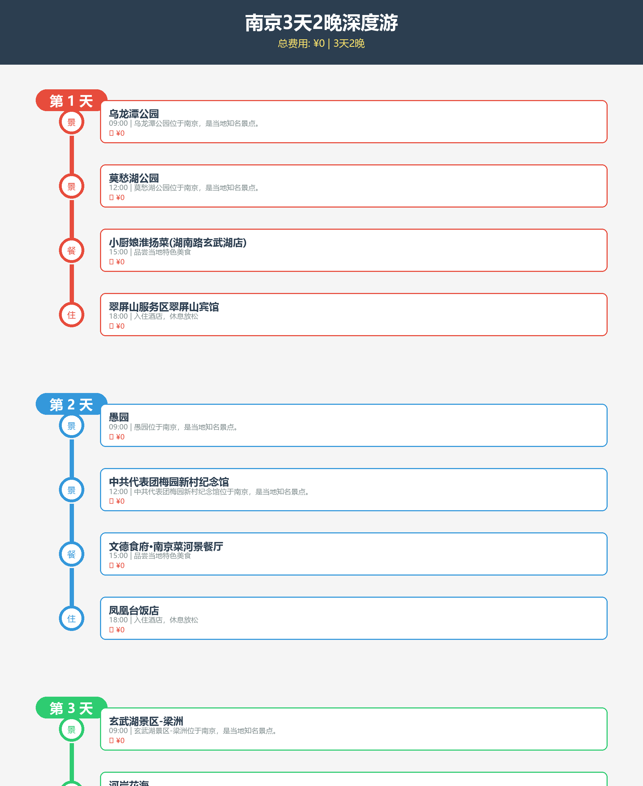
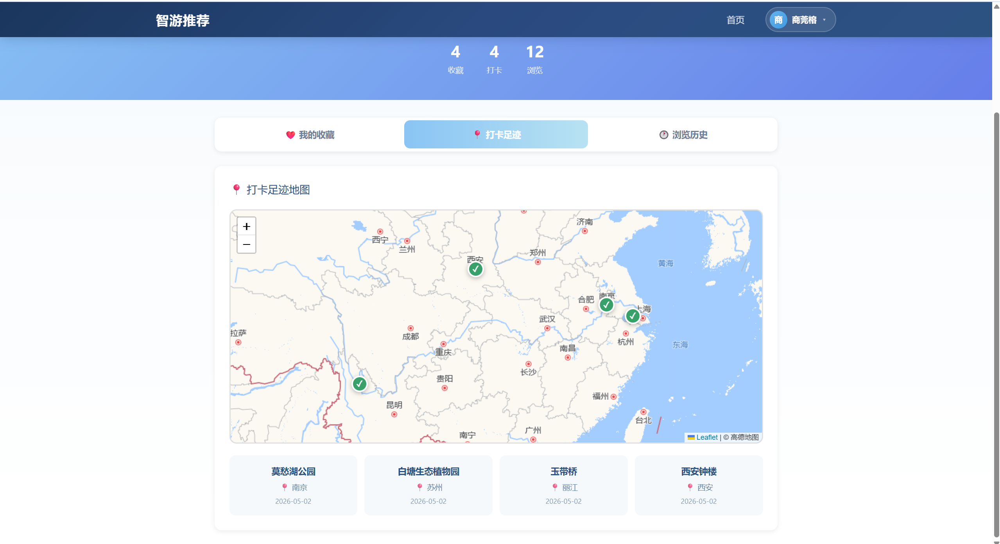
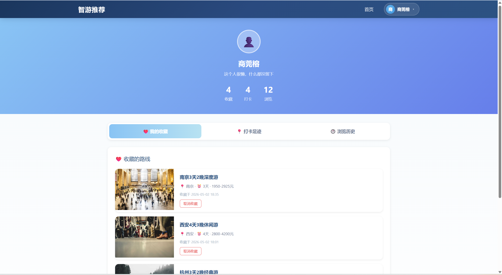
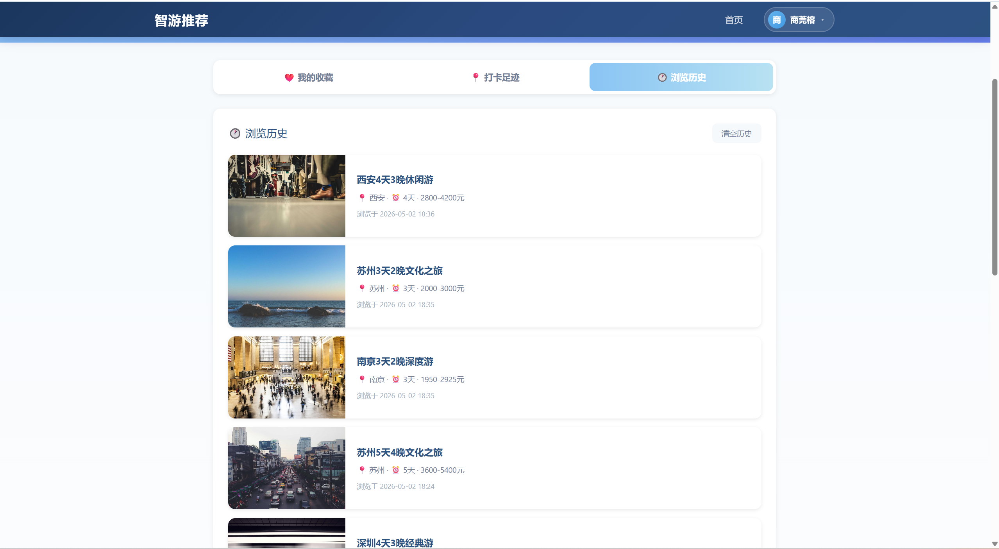

# 旅游推荐平台

一个基于 Flask + SQLite + Leaflet 的智能旅游路线推荐系统，支持个性化定制、地图可视化、用户收藏与足迹管理。项目包含15个热门旅游城市，97条精选路线，750+景点/酒店/餐厅POI数据，适用于简历展示、课程设计或实际应用。

## 功能特性

### 核心功能
- **智能路线推荐**：根据城市、出行方式（公共交通/自驾）推荐热门路线
- **地图可视化**：Leaflet + 高德地图瓦片，实时定位景点/酒店/餐厅
- **路线详情页**：左右分屏布局，左侧地图全屏展示，右侧行程时间线滚动查看
- **个性化定制**：用户可收藏路线、标记“去过”景点、查看浏览历史

### 用户系统
- 注册/登录（Session + 密码哈希）
- **收藏管理**：收藏喜欢的路线，在个人中心查看
- **足迹地图**：在路线详情页点击“去过”记录景点足迹，Leaflet地图标注
- **浏览历史**：自动记录查看过的路线，按时间倒序展示

### 实用工具
- **POI数据爬取**：基于高德地图API批量爬取景点/酒店/餐厅数据（15城×3类×50条）
- **行程图片导出**：支持现代卡片、地铁图、信息图三种样式（PIL生成）
- **响应式设计**：适配桌面/平板/手机，窄屏自动切换单列布局

## 技术栈

### 后端
- **Python 3.8+**，Flask 2.3+，SQLAlchemy 2.0+
- **数据库**：SQLite（开发），支持 PostgreSQL 迁移
- **API服务**：RESTful JSON API，14个用户相关端点
- **地图服务**：高德地图Web服务API（POI检索、地理编码）

### 前端
- **HTML5 + CSS3**：Flexbox布局，响应式设计
- **JavaScript (ES6)**：原生JS + Fetch API，无前端框架
- **地图库**：Leaflet 1.9+，高德地图瓦片
- **图表**：Chart.js（个人中心数据可视化）

### 数据与工具
- **数据采集**：requests + 高德API，支持增量爬取
- **图片处理**：Pillow（PIL）用于行程图片导出
- **环境配置**：python-dotenv，敏感信息隔离
- **日志系统**：Python logging，文件+控制台输出

## 项目结构

```
travel_recommending/
├── app.py                 # Flask主应用
├── config.py              # 配置文件
├── models/                # 数据库模型
│   ├── database.py        # SQLAlchemy配置
│   ├── route.py           # 路线模型
│   ├── attraction.py      # 景点模型
│   ├── hotel.py           # 酒店模型
│   ├── restaurant.py      # 餐厅模型
│   ├── user.py            # 用户模型
│   └── user_data.py       # 收藏/足迹/历史模型
├── services/              # 业务服务层
│   ├── map_service.py     # 地图服务
│   └── poi_service.py     # POI坐标服务
├── scripts/               # 数据脚本
│   ├── init_db.py         # 数据库初始化
│   ├── import_data.py     # 基础数据导入
│   ├── scrape_amap_poi.py # 高德POI爬取（核心）
│   └── update_images.py   # 图片下载更新
├── templates/             # Jinja2模板
│   ├── index.html         # 首页（定制推荐）
│   ├── route_detail.html  # 路线详情页
│   ├── profile.html       # 个人中心
│   ├── login_modal.html   # 登录弹窗
│   └── layout.html        # 基础布局
├── static/                # 静态资源
│   ├── css/
│   ├── js/
│   │   └── main.js        # 前端主逻辑
│   └── images/            # 封面图、地图标记
├── data/                  # 数据文件
│   ├── travel.db          # SQLite数据库
│   ├── cities.json        # 城市列表（省份-城市映射）
│   └── routes.json        # 路线基础数据
├── export_itinerary.py    # 行程图片导出
└── export_styles.py       # 导出样式定义
```


## 使用指南

### 1. 首页定制推荐
1. 选择 **省份 → 城市 → 出行方式**（公共交通/自驾）
2. 点击“开始定制”获取推荐路线（按热度排序前4条）
3. 点击路线卡片查看详情

### 2. 路线详情页
- **左侧地图**：查看路线空间分布，点击图例切换POI类型显示
- **右侧行程**：按时间顺序查看每日安排，点击景点可地图定位
- **功能按钮**：
  - ❤️ 收藏：添加到个人收藏
  - 🗺️ 去过：标记单个景点为足迹（支持重复标记过滤）
  - 📷 导出：生成行程图片（三种样式可选）

### 3. 个人中心
- **收藏夹**：管理收藏的路线，一键跳转详情
- **足迹地图**：Leaflet地图展示去过的景点（城市坐标硬编码）
- **浏览历史**：最近查看的路线，按时间倒序排列

### 4. 数据管理（管理员）
- 使用 `scripts/scrape_amap_poi.py` 更新POI数据
- 直接编辑 `data/routes.json` 调整路线信息
- 重启Flask应用使更改生效

## 系统运行截图

### 登录与首页



### 路线推荐与筛选



### 景点与路线详情



### 个人中心



